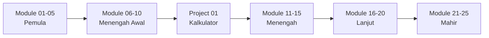

# 🐍 Framework Pembelajaran Python

<div align="center">


**Framework pembelajaran Python komprehensif dari dasar hingga mahir**  
*Dengan penjelasan detail dalam Bahasa Indonesia 🇮🇩*

[📚 Mulai Belajar](#-mulai-belajar) •
[📖 Modul](#-daftar-modul) •
[🎯 Fitur](#-fitur-unggulan) •
[💡 Cara Pakai](#-cara-menggunakan)

</div>

---

## 📋 Tentang Framework Ini

Framework pembelajaran Python yang dirancang khusus untuk pemula hingga menengah dengan:
- ✅ **25 Modul** terstruktur dari basic hingga advanced
- ✅ **Penjelasan super detail** dengan 5,000+ baris dokumentasi
- ✅ **100% Bahasa Indonesia** - mudah dipahami
- ✅ **Banyak contoh kode** yang dapat langsung dijalankan
- ✅ **Latihan & Project** untuk praktik

## 🎯 Fitur Unggulan

| Fitur | Deskripsi |
|-------|-----------|
| 📚 **Komprehensif** | 25 modul dari pemula hingga mahir |
| 🇮🇩 **Bahasa Indonesia** | Semua materi dalam Bahasa Indonesia |
| 💻 **Praktis** | Examples & exercises di setiap modul |
| 🎓 **Terstruktur** | Learning path yang jelas dan progresif |
| 🚀 **Project-Based** | Mini projects untuk apply knowledge |
| 📝 **Dokumentasi Lengkap** | README detail di setiap modul |

## � Daftar Modul

### 🟢 Level Pemula (Beginner)
Modul | Topik | Status | Estimasi Waktu
------|-------|--------|----------------
[01](./modules/01-pengenalan-python/) | Pengenalan Python & Instalasi | ✅ Complete | 2 jam
[02](./modules/02-variabel-tipe-data/) | Variabel & Tipe Data | ✅ Complete | 3 jam
[03](./modules/03-operators/) | Operators | ✅ Complete | 2 jam
[04](./modules/04-string-methods/) | String & String Methods | ✅ Complete | 3 jam
[05](./modules/05-input-output/) | Input & Output | ✅ Complete | 2 jam

**Total: 12 jam • Target: 1-2 minggu**

### 🟡 Level Menengah Awal (Elementary)
Modul | Topik | Status | Estimasi Waktu
------|-------|--------|----------------
[06](./modules/06-control-flow/) | Control Flow (If-Else) | ✅ Complete | 3 jam
[07](./modules/07-loops/) | Loops (Perulangan) | ✅ Complete | 3 jam
[08](./modules/08-lists-tuples/) | Lists & Tuples | ✅ Complete | 4 jam
[09](./modules/09-dictionaries-sets/) | Dictionaries & Sets | 📋 Planned | 4 jam
[10](./modules/10-functions/) | Functions (Fungsi) | ✅ Complete | 4 jam

**Total: 18 jam • Target: 2-3 minggu**

### 🟠 Level Menengah (Intermediate)
Modul | Topik | Status | Estimasi Waktu
------|-------|--------|----------------
11 | Modules & Packages | 📋 Planned | 3 jam
12 | File Handling | 📋 Planned | 4 jam
13 | Exception Handling | 📋 Planned | 3 jam
14 | OOP Basics | 📋 Planned | 5 jam
15 | OOP Advanced | 📋 Planned | 5 jam

**Total: 20 jam • Target: 3-4 minggu**

### 🔴 Level Lanjut (Advanced)
Modul | Topik | Status
------|-------|--------
16 | List Comprehension & Generators | 📋 Planned
17 | Decorators | 📋 Planned
18 | Regular Expressions | 📋 Planned
19 | Working with APIs | 📋 Planned
20 | Database (SQLite) | 📋 Planned

### 🚀 Level Mahir (Expert)
Modul | Topik | Status
------|-------|--------
21 | Multi-threading & Multi-processing | 📋 Planned
22 | Testing (Unit Tests) | 📋 Planned
23 | Virtual Environments & Pip | 📋 Planned
24 | Data Analysis (Pandas Basics) | 📋 Planned
25 | Web Scraping | 📋 Planned

## 🚀 Mulai Belajar

### Prasyarat

- Python 3.8 atau lebih baru ([Download](https://www.python.org/downloads/))
- Text editor (VS Code, PyCharm, atau IDLE)
- Terminal/Command Prompt
- Waktu 30 menit/hari untuk belajar

### Quick Start

```bash
# 1. Clone repository ini
git clone https://github.com/username/belajar-python.git
cd belajar-python

# 2. Baca getting started guide
cat GETTING_STARTED.md

# 3. Mulai dari module pertama
cd modules/01-pengenalan-python

# 4. Baca README dan jalankan contoh
python examples/hello_world.py
```

## 💡 Cara Menggunakan

### 1️⃣ Ikuti Urutan Modul
Jangan skip! Setiap modul membangun konsep dari modul sebelumnya.

### 2️⃣ Workflow Belajar
```
Baca README.md → Jalankan Examples → Eksperimen → Kerjakan Exercises → Next Module
```

### 3️⃣ Tips Belajar
- 📅 **Konsisten** - Minimal 30 menit/hari lebih baik dari 5 jam/minggu
- 💻 **Praktik** - 20% baca, 80% coding
- 🐛 **Jangan takut error** - Error adalah bagian dari belajar
- 🎯 **Buat project** - Apply what you learn

## 📁 Struktur Folder

```
belajar-python/
│
├── 📄 README.md                    # File ini
├── 📄 GETTING_STARTED.md           # Panduan memulai lengkap
├── 📄 FRAMEWORK_SUMMARY.md         # Summary & progress tracker
│
├── 📁 modules/                     # Semua modul pembelajaran
│   ├── 01-pengenalan-python/
│   │   ├── README.md              # Penjelasan konsep
│   │   ├── examples/              # Contoh kode
│   │   └── exercises/             # Latihan
│   ├── 02-variabel-tipe-data/
│   └── ...
│
├── 📁 projects/                    # Mini projects
│   └── 01-kalkulator-lengkap/
│
└── 📁 resources/                   # Sumber daya tambahan
    └── cheat-sheets/              # Lembar contekan
        └── python-basics.md
```

## 🎓 Learning Path



## 🎯 Setelah Menyelesaikan Framework Ini

Anda akan mampu:
- ✅ Memahami fundamental Python dengan mendalam
- ✅ Menulis kode Python yang bersih dan efisien
- ✅ Menguasai OOP (Object-Oriented Programming)
- ✅ Bekerja dengan file, database, dan API
- ✅ Membuat aplikasi Python sederhana hingga menengah
- ✅ Memahami konsep advanced (decorators, generators)
- ✅ Melakukan data analysis dasar
- ✅ Membuat web scraper
- ✅ Menulis unit tests

## � Dokumentasi Tambahan

- 📖 [Getting Started Guide](./GETTING_STARTED.md) - Tutorial lengkap cara memulai
- 📊 [Framework Summary](./FRAMEWORK_SUMMARY.md) - Overview & statistik
- 📝 [Python Cheat Sheet](./resources/cheat-sheets/python-basics.md) - Quick reference
- 🎉 [Complete Guide](./🎉_FRAMEWORK_COMPLETE.md) - Dokumentasi lengkap

## 🤝 Kontribusi

Kontribusi sangat diterima! Jika Anda ingin berkontribusi:

1. Fork repository ini
2. Buat branch baru (`git checkout -b feature/AmazingFeature`)
3. Commit perubahan (`git commit -m 'Add some AmazingFeature'`)
4. Push ke branch (`git push origin feature/AmazingFeature`)
5. Buat Pull Request

### Yang Bisa Dikontribusikan
- ✍️ Perbaikan typo atau penjelasan
- 💡 Menambah contoh kode
- 📝 Menambah latihan
- 🎯 Membuat module baru (11-25)
- 🚀 Menambah mini projects

## 📜 License

Distributed under the MIT License. See `LICENSE` for more information.

## 💬 Feedback & Support

- 🐛 **Issues**: Laporkan bug atau saran di [GitHub Issues](https://github.com/username/belajar-python/issues)
- 💡 **Diskusi**: Gunakan [GitHub Discussions](https://github.com/username/belajar-python/discussions)
- ⭐ **Star**: Jika framework ini membantu, berikan star!

## 📊 Progress


- ✅ Module 01-08, 10 Complete (9/25)
- 📋 Module 09, 11-25 Planned
- 🎯 Projects: 1 template ready

## 🌟 Acknowledgments

Framework ini terinspirasi dari:
- [Python Official Documentation](https://docs.python.org/)
- [Real Python](https://realpython.com/)
- Pengalaman mengajar Python di berbagai komunitas

## 📞 Connect

- 💼 LinkedIn: [Naidrahiqa](https://www.linkedin.com/in/naidrahiqa/)
- 🐦 Twitter: [@Naidrahiqa](https://twitter.com/Naidrahiqa)
- 📧 Email: akufaqih1@gmail.com

---

<div align="center">

**Dibuat dengan ❤️ untuk komunitas Python Indonesia**

⭐ Star repository ini jika membantu! ⭐

[Kembali ke atas](#-framework-pembelajaran-python)

</div>
